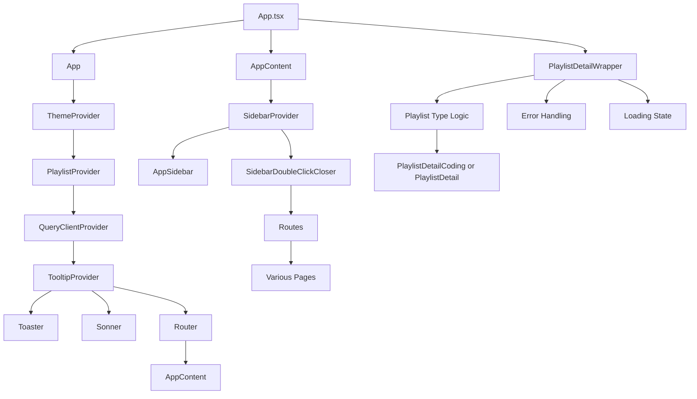

# App.tsx Documentation

## Overview

`src/App.tsx` is the main entry point for the React application. It sets up global providers, routing, and the overall layout. The file is responsible for:
- Theme and context providers
- Query client setup for data fetching
- Routing between all major pages
- Sidebar and layout logic
- Dynamic rendering of playlist detail pages based on playlist type

## Main Components & Logic

### 1. App
- The root component.
- Wraps the application in providers: `ThemeProvider`, `PlaylistProvider`, `QueryClientProvider`, and `TooltipProvider`.
- Sets up the main router and notification systems (`Toaster`, `Sonner`).

### 2. AppContent
- Handles the main layout and routing.
- Uses `SidebarProvider` to manage sidebar state.
- Renders the sidebar except on authentication pages.
- Contains all main routes for the app (dashboard, library, classroom, etc.).
- Loads questions from file on mount.

### 3. PlaylistDetailWrapper
- Handles dynamic routing for playlist detail pages.
- Reads playlists from localStorage and determines if the playlist is of type 'video' or 'coding'.
- Renders the appropriate detail component (`PlaylistDetail` or `PlaylistDetailCoding`).
- Handles error and loading states for playlist lookup.

### 4. SidebarDoubleClickCloser
- Utility component to allow toggling the sidebar by double-clicking.

## Routing
- Uses `react-router-dom` for client-side routing.
- Defines routes for all major pages, including dynamic playlist and video player routes.
- Handles 404s with a `NotFound` page.

## Providers
- **ThemeProvider**: Manages light/dark mode.
- **PlaylistProvider**: Context for playlist state.
- **QueryClientProvider**: For React Query data fetching.
- **TooltipProvider**: For tooltips across the app.
- **SidebarProvider**: Manages sidebar open/close state.

## Error Handling
- Playlist detail routes handle missing or malformed playlist data gracefully, showing error messages and a button to return to the library.

## Mermaid Diagram

## File Location
- Source: `src/App.tsx`
- Documentation: `documentation/App.tsx.md` 